```{r setup, include=FALSE}
knitr::opts_chunk$set(echo = TRUE)
```

## Tópicos

Introdução: Explicação do contexto da tecnologia timelion, do SVDados e formato de tabela única e expectativas

Problema: Explicação do problema do formato de dados de tabela única e da validação no timelion

Dados: Explicação dos dados de teste montados: Distribuição normal, tipos de dados, ideia para indicadores

Testes no timelion: Explicação dos testes realizados no timelion (as visualizações construídas e dashboards)

Adeno específico: Necessário explicar o problema dos buckets temporais, e os testes realizados. Por exemplo:

-As agregações foram auditadas no R, e estão corretas para as subpartes testadas, sendo muito provável que esteja totalmente correta. Os dados no R estão completos.

-Os dados foram todos enviados corretamente ao elasticsearch, e isso foi testado por meio de aggregations temporais em subpartes dos dados.

-Descobri que, ao realizar as aggregations, quando o dado é de um período maior que o do período escolhido, haverá discrepância nas visualizações devido à distribuição entre os buckets.

-Para os dados semanais em específico, há uma determinada discrepância nas viradas de ano: O timelion parece não recomeçar a contagem de semanas quando um novo ano se inicia, e por esse motivo, soma duas vezes a coluna marcadora.

-A hipótese é justamente esta: O timelion não recomeça a contagem semanal a cada ano, mas o tidyverse do R sim. Esta característica do timelion poderia ser inclusive um problema para a visualização das semanas epidemiológicas.

-O funcionamento das dashboards foi testado, é uma grande ambiguidade: Pode-se trabalhar com diversos index's, e visualizações esperando filtros. No entanto é possível encontrar incoerências quando da construção ou não de visualizações
generalistas (que esperam filtros).

-Impossibilidade de mudanças do interval em uma dashboard específica: https://discuss.elastic.co/t/dropdown-for-selecting-timelion-interval-in-dashboard/166544 .

-Questões do offset para o timelion, relativo à corretude da exibição dos dados semanais, que deveriam possuir a mesma data de início que os dados presentes no banco de dados (para a exibição das semanas epidemiológicas).

-Linhas verticais no timelion são limitadas (parece que ainda não há suporte para esta funcionalidade).

-Problemas para realizar querys em strings com caracteres especiais como "-" e "/".


## Introdução 

No contexto da saúde, na grande maioria dos casos, a precaução é idealmente melhor e mais satisfatória que a remediação. Deste modo, as tecnologias de inteligência tornam-se ferramentas cruciais para a manutenção da saúde coletiva da sociedade, por serem importantes ferramentas de precaução e tomada de decisão. Os indicadores entomológicos e epidemiológicos são ferramentas importantes para realizar o acompanhamento do relacionamento das arboviroses com as populações humanas. Nesse sentido, é possível realizar o acompanhamento em tempo real dos acontecimentos interessantes à vigilância, por meio de infraestruturas como o ELK (elasticserch, logstash e kibana) e tecnologias como o timelion e a linguagem de programação R. Para isso, é necessário o domínio de uma estrutura de dados satisfatória para que se possa gerar e aproveitar dados em tempo real. Neste relatório, com o objetivo de validar uma estrutura de dados proposta para utilização no elasticsearch, e de validar a tecnologia timelion (um plug-in do kibana) como uma opção viável para a exibição de indicadores, será criada passo a passo uma massa de dados para testes, no formato proposto e na linguagem de programação R, e será utilizado o timelion para construir validações e visualizações pertinentes.

## A estrutura de dados de uma tabela única

<!-- Criar uma explicação melhor para o que seria uma tabela única, e não partir diretamente para o exemplo da tabela única mais simples. Ou pode-se explicar o formato das linhas no próprio exemplo -->
Para a rápida visualização de dados e geração de indicadores em tempo real, é importante que os dados sejam consolidados/gerados em um formato que permita o rápido acesso e a rápida realização de cálculos e pesquisas. Soluções tradicionais, como bancos de dados relacionais, não são soluções viáveis para a visualização em tempo real de dados em larga escala. O SGBD (sistema gerenciador de banco de dados) elasticsearch, foi pensado desde o seu princípio como um SGBD capaz de fornecer a possibilidade de buscas e cálculos rápidos. Neste sentido, a utilização do formato de tabelas únicas (uma só tabela para um universo de dados inteiro) é de extrema utilidade, pois permite a realização de buscas rápidas e cálculos rápidos. No entanto, tais tabelas podem acometer-se de graves problemas, como o grande espaço de armazenamento que exigem, ou incoerências relativas às informações registradas. Uma das tabelas de concepção mais simples, seria uma tabela em que os seus detalhamentos: Temporal (se o dado refere-se à um dia, mês ou ano), espacial (se o dado refere-se à um Estado ou um Município) entre outros, e as colunas que indicam o dado referente (população, indicadores, entre outros) possuem cada um uma coluna. 

Neste caso mais simples, se você possui uma tabela dentro de um banco de dados que possui uma coluna com o Estado (um string indicando o Estado ao qual a observação(linha) possui informações) e uma coluna com a sua respectiva população, na tabela final você manterá essas mesmas colunas, preenchendo com valores vazios as linhas que não contiverem essas informaçoes. Ainda assim, a união de todas as tabelas de um mesmo domínio (universo sobre o qual os dados possuem informações), possui diversas complicações, que também dependem da maneira com a qual o dado será estruturado. Ao preencher níveis de detalhamento que não são o maior possível para um determinado dado (se você possui um dado de um dia, você também possui a informação de a qual ano e mês este dado pertence), ao realizar agregações no nível menos detalhado, poderá-se chegar a problemas, pois somar-se-á dados que não possuem o mesmo significado (dados referentes à quantitativos de dias com dados referentes à quantitativos de anos, por exemplo). Esta situação pode ocorrer facilmente, pois geralmente as tabelas presentes em diversos bancos de dados, possuem informações referentes à diferentes níveis de detalhamento, apesar de o dado referir-se à apenas um. Por exemplo: Um dado que foi coletado em uma semana epidemiológica, também possui uma coluna que indica o mês epidemiológico, o ano, e a década. Ao colocar esta tabela, em conjunto com outra tabela que possui dados referentes à um mês epidemiológico, em uma só tabela, pode chegar-se a graves problemas de consistência dos dados. Esse problema, possui solução de difícil automatização, e neste relatório, irá ser abordada somente uma solução referente à estrutura com a qual as tabelas devem ser unificadas.  

obs: Em todas as tabelas abaixo, considere que as querys (consultas) não consomem linhas onde a coluna utilizada como filtro está vazia. Por exemplo, ao agregar-se por mês, uma coluna com o mês vazio não será considera pela query.

Podemo dar o exemplo de tabela única com todos os níveis de detalhamento disponíveis preenchidos:

```{r, echo = FALSE}

data.frame(mes = c("01/2010", "02/2010", NA, "03/2012"), 
           ano = c(2010, 2010, 2010, 2012), consumo = c(25, 13, 213, 14))

```

Caso alguém decida verificar o consumo total no ano de 2010, fazendo um filtro na coluna de "ano", o valor correto esperado seria: 38, enquanto que o valor calculado, caso nenhum filtro seja realizado nesta tabela, seria 251. Isso decorre do fato de que uma das linhas da tabela que contém a informação par ao ano de 2010, na verdade indica exatamente a resposta que queremos: O consumo em todo o ano de 2010. Assim, para resolver esse problema, apenas o nível de detalhamento ao qual a observação pertence deve ser preenchido (se for o consumo de um mês, apenas a coluna mês estará preenchida). Segue o exemplo abaixo: 

```{r, echo = FALSE}

data.frame(mes = c("01/2010", "02/2010", NA, "03/2012"),
           ano = c(NA, NA, 2010, NA), consumo = c(25, 13, 213, 14))

```

Neste caso, portanto, ao agregar-se por mês, teremos apenas os dados de consumo referentes à meses. E ao agregar-se por ano, teremos apenas os dados de consumo referentes à anos. 

Ainda neste contexto, outro problema identificado, é referente a unificação de tabelas que possuem colunas totalmente distintas, mas que também possuem seus dados referentes à um mesmo nível de detalhamento: Por exemplo, dados referentes à semanas epidemiológicas. Neste contexto, uma solução correta mas não ótima, seria apenas acrescentar as colunas inexistentes de uma tabela na outra (e vise-versa), e unir-las por meio de uma junção de linhas (pois ambas teriam as mesmas colunas). No entanto, esta solução gasta exponencialmente muito espaço. Acontece que, se os dados são referentes à um mesmo dia, haverão linhas que poderiam ser unificadas em uma só linha, diminuindo o tamanho final da tabela única. Este processo é popularmente conhecido como um "join". No entanto, não é sempre que é consistente ou possível a realização de joins nas tabelas que virão a ser unificadas. 

<!-- Dar um exemplo acerca de linhas que poderiam vir a ser unificadas -->

Considere as duas tabelas abaixo:

```{r, echo = FALSE} 

data.frame(mes = c("01/2010", "03/2010"), ano = c(NA, NA), consumo = c(25, 8))

```


```{r, echo = FALSE} 

data.frame(mes = c("01/2010", "03/2010"), ano = c(NA, NA), desperdicio = c(4, 2))

```

Estas tabelas poderiam ser unificadas em uma tabela única por meio de uma junção por linhas, o formato final ficaria assim:

```{r, echo = FALSE} 

data.frame(mes = c("01/2010", "03/2010","01/2010", "03/2010"), ano = c(NA, NA, NA, NA), 
           consumo = c(25, 8, NA, NA), desperdicio = c(NA, NA, 4, 2))

```

Este formato estaria correto, e iria funcionar quando a tabela fosse, consultada. No entanto, é um formato um pouco confuso, e que ocupa muito mais espaço de armazenamento. Neste caso em específico, deveria-se realizar uma junção segundo dia:

```{r, echo = FALSE}

data.frame(mes = c("01/2010", "03/2010"), ano = c(NA, NA), consumo = c(25, 8), desperdicio = c(4, 2))


```

Perceba no entanto que este processo não pode ser realizado, quando tem-se tabelas com diferentes níveis de detalhamento, aonde a junção deverá ser por linhas:

```{r, echo = FALSE} 

data.frame(mes = c("01/2010", "03/2010"), consumo = c(25, 8))

```

```{r, echo = FALSE}

data.frame(ano = c(2010), consumo = c(236))

```

Assim o resultado final seria:

```{r, echo = FALSE} 

data.frame(mes = c("01/2010", "03/2010", NA), ano =  c(NA, NA, 2010), consumo = c(25, 8, 236))

```

Sendo este o formato final de uma tabela unificada no SVDados.

## A validação das visualizações no timelion e os problemas encontrados

O timelion é um plug-in do kibana que permite a geração de gráficos por meio de uma linguagem de programação declarativa. Esta tecnologia apresenta características interessantes para a exibição de indicadores, que podem ser de extrema valia para o projeto arbocontrol. É possível realizar querys em diferentes indexs do elasticsearch, e relacionar os resultados por meio de faixas temporais, em gráficos com diferentes formatos (linha, barras, entre outros). Além disso, também é possível realizar operações matemáticas entre as querys, que podem envolver o mesmo index, ou diferentes index's do elasticsearch, sendo possível portanto a geração em tempo real de indicadores. O kibana investiga os dados presentes no elasticsearch de acordo com métricas como "dados acerca das três últimas horas". Tal versatilidade permite acompanhar os acontecimentos em tempo real, quando com a infraestrutura necessária. 

A tecnologia do timelion possui algumas dificuldades para a validação dos gráficos que apresenta, referentes à sua corretude. Como estamos tratando do reuso de software, a equipe não detém o conhecimento acerca do funcionamento técnico da ferramenta, o que precisa ser colocado em validação. Existem diversos caminhos para tal, como a engenharia reversa, pois é uma aplicação de código aberto, ou a criação de medidas de validação das visualizações geradas por meio da comparação com outras tecnologias ou elucidações necessárias. Neste contexto, a população de dados no elasticsearch precisa ser também validada, para certificar-se que os dados se encontram consistentes. Especificamente o kibana, tem sua implementação em javascript, e seu código fonte encontra-se no endereço: https://github.com/elastic/kibana.  

## Caso de teste para a validação da estrutura de tabela única e do timelion como tecnologia para a exibição de indicadores

Para a validação do formato de tabela única, e da tecnologia do timelion consumindo essa estrutura de dados, foram criados dados aleatórios, seguindo uma distribuição aleatória normal truncada, por meio da linguagem de programação R e de pacotes como o EnvStates e o desenvolvido pela equipe do centeias, CRISPDM. Os dados buscam representar o domínio da pluviosidade, apresentando dados referentes à pluviosidade e à evaporaçao para algumas regiões, em uma determinada faixa de tempo. Por meio destes indicadores, é possível gerar gráficos no timelion capazes de indicar o comportamento climático da região (se é mais árida, ou mais chuvosa).

Pode-se encontrar informações acerca da distribuição normal truncada no endereço https://en.wikipedia.org/wiki/Truncated_normal_distribution (em inglês). A biblioteca EnvStats também apresenta as fórmulas matemáticas que utiliza no endereço: https://www.rdocumentation.org/packages/EnvStats/versions/2.3.1/topics/NormalTrunc. A escolha referente à distribuição normal truncada refere-se ao fato de que os dados de pluviosidade e evaporação não podem tanto possuir valores negativos, quanto ultrapassar determinados valores. Além disso, a criação de uma distribuição normal permite o acompanhamento das curvas normais nos gráficos, apesar de que, até o momento, neste projeto, as distribuições foram realizadas para um período de um ano (365 observações por ano), o que limita a visualização da reta da distribuição normal truncada devido à baixa quantidade de observações. É possível modificar os dados, para que essas distribuições sejam realizadas em todo o período de testes, aqui por exemplo, entre os anos de 2013 a 2019. 

Para a criação dos dados foram primeiramente gerados vetores com os anos escolhidos: São os vetores coluna_data_2013 a coluna_data_2019. 

```{r, results="hide"}

library(lubridate)

#Definindo operador para concatenacao de strings
'%%' <- function(x, y) paste0(x,y) 

dias <- 1:364

#Definindo data inicial para construir um vetor com todos os dias do ano, 
#para cada ano escolhido
dataInicial <- "2013-01-01"

dataInicial <- as.Date(dataInicial)

#Criando um vetor com 364 elementos,
#todos preenchidos com a data inicial. 
#Este serah usado para calcular cada dia 
#do ano a partir da data inicial
colunaData <- rep(dataInicial, 364)

#construidos os dias 02 ao 365 do ano por meio da soma 
#do vetor de dias com a data inicial, 
#utilizando a funcao "day" que faz operacoes no dominio 
#dos dias
day(colunaData) <- day(colunaData) + dias

#Criando um vetor com os 365 dias do ano, por meio da adicao da 
#data inicial ao vetor, que seria o primeiro dia do ano
colunaData <- c(dataInicial, colunaData)


coluna_data_2013 <- colunaData
aux <- colunaData

#Criado vetor de anos para nomear variaveis de coluna_data_[ano], 
#por meio de meta programacao
anos <- c(2014, 2015, 2016, 2017, 2018, 2019)

#Cria as colunas para os restantes dias do ano, 
#o valor eh calculado por "aux" 
#e a variavel eh salva globalmente com o nome dado 
#pelo parse da metaprogramacao
for(i in 1:length(anos)) {
  
  year(aux) <- year(aux) + 1
  
  eval(parse(text = 
               "coluna_data_" %% anos[i] %% "<- aux"               
             
  ))
  
}

#Atualizado vetor com todos os anos disponiveis
anos <- c(2013, anos)

```

Em seguida, foi criado um vetor com 4 regiões (unidades federativas brasileiras), sobre as quais, segundo os anos disponíveis, serão realizadas as distribuições normais truncadas para as variáveis evaporação e pluviosidade:

``` {r, results="hide"}
library(dplyr)
library(data.table)
library(lubridate)
library(elastic)
library(EnvStats)

#Vetor que apresenta as quatro regioes, 
#sendo Df = Distrito Federal, 
#AC = Acre, 
#RJ = Rio de Janeiro, 
#SP = São Paulo 
ufs <- c("DF", "AC", "RJ", "SP")

pluviosidade <- NULL

distribuicoesNormais <- NULL 

#***
#criado um data frame (df) para cada ano, 
#com uma distribuição normal 
#truncada para pluviosidade e evaporação 
#em cada ano de cada Estado, 
#ao mesmo tempo estes data frames sao unificados 
#em um soh denomiado "pluviosidade"
for(estado in ufs) {
  
  #Define medias e desvios padroes para 
  #a pluviosidade e evaporacao de cada estado
  meanPluv <- round(runif(1, 1, 4)) #pluviosidade
  sdPluv <- round(runif(1, 1, 4))  
  
  meanEvap <- round(runif(1, 1, 4)) #Evaporacao
  sdEvap <- round(runif(1, 1, 4))
  
  #registra os valores aleatorios gerados pelas funcoes
  distribuicoesNormais <- rbind(distribuicoesNormais, 
                                data.frame(estado = estado, 
                                           meanPluv = meanPluv, 
                                           sdPluv = sdPluv, 
                                           meanEvap = meanEvap,
                                           sdEvap = sdEvap)) 
  
  for(i in 1:length(anos)) {
  
    #constroi vetores de pluviosidade e 
    #evaporacao seguindo a distribuicao normal 
    #com os parametro de cada estado para cada ano
    valorPluv <- rnormTrunc(365, mean = meanPluv, 
                            sd = sdPluv, min = 0, max = 60)
    #distribuicao normal com 356 observacoes 
    #truncada no intervalo (0,60)
    
    valorEvap <- rnormTrunc(365, mean = meanEvap, 
                            sd = sdEvap, min = 0, max = 60)
    
    #Cria os dados para cada ano, e os 
    #junta por meio de uma 
    #junção por linhas, para gerar o data frame 
    #final "pluviosidade" que contem 
    #todos os dados diarios para cada uma das 4 regioes
    df_aux <- data.frame(data = eval(as.symbol("coluna_data_" %% anos[i])), 
                         pluviosidade = valorPluv, 
                         evaporacao = valorEvap,
                         UF = rep(estado, 365))
    
    pluviosidade <- rbind(pluviosidade, df_aux)
  
    rm(df_aux)

  }
  
}

```

Observe que futuramente este loop "for(estado in ufs)" irá tornar-se uma função, devido à experimentação de padrões para a legibilidade do código, e às necessidades vindouras. 

Em seguida, para gerar os dados consolidados por semana, mês e ano, foi utilizada a seguinte função: 

```{r, results="hide"}

#A funcao setDT cria um data frame a partir das colunas, 
#agregando os valores por determinada caracteristica (fator) 
#nas colunas escolhidas. O funcionamento eh semelhante 
#ao group_by do dplyr ou do SQL comum
#Abaixo a pluviosidade e a evaporacao sao agregadas 
#por soma, para semana, mes e ano. 
dfSemana <- setDT(pluviosidade)[, .(pluviosidade = sum(pluviosidade), 
                                    evaporacao = sum(evaporacao)), 
                                by = .(yr = year(data), fator = week(data), UF = UF)]

dfMes <- setDT(pluviosidade)[, .(pluviosidade = sum(pluviosidade),
                                 evaporacao = sum(evaporacao)), 
                             by = .(yr = year(data), fator = month(data), UF = UF)]
dfAno <- setDT(pluviosidade)[, .(pluviosidade = sum(pluviosidade), 
                                 evaporacao = sum(evaporacao)), 
                             by = .(yr = year(data), UF = UF)]


```

Para formatar as datas no formato padrão foi utilzada uma função. A função para a criação da data padrão, é uma função do pacote interno CRISPDM construída a partir de meta-programação, com o objetivo de generalizar a formatação de uma data, caso ela funcione segundo ou segundos, ou minutos, ou horas, ou dias, ou mês, ou semanas, colocanda as datas no formato padrão de datas reconhecidos pelo ELK. A metaprogramação foi uma opção para fornecer maior legibilidade (não utilizar if's aninhados) para escolher qual função do pacote lubridate será utilizada, como por exemplo "week", para um detalhamento de semanas. 

```{r, results="hide"}


library(stringi)
library(lubridate)

#- Recebe coluna = coluna de datas especificas 
#com determinado detalhamento,
#posAno = vetor com dois elementos, o inicio do ano 
#na string coluna e o final da string ano na string coluna,
#posFator = vetor com dois elementos, 
#o inicio da string do fator (quantos segundos, minutos, horas) 
#e o final da string fator, 
#tipoFator = o nome da função lubridate que lida 
#com o nivel de detalhamento especifico (segundo, minutos, dias)

#- inclui a ultima data do detalhe (a ultima hora do dia)
#a coluna, calcula cada observacao segundo o fator

#- Retorna coluna de datas formatada segundo o elasticsearch, 
#podendo ser advinda de uma agregacao de group_by
cria_data_padrao_fator_peso <- function(coluna, posAno = NULL, 
                                        posFator = NULL, tipoFator = NULL) {
  
  '%%' <- function(x,y) paste0(x,y)
  
  if(is.data.frame(coluna)) {
    return(print("coluna deve ser um vetor"))
  }
  
  if(is.null(posAno)) {
    
    ano <- substring(coluna, 1, 4)
    
  } else{
    
    ano <- substring(coluna, posAno[1], posAno[2])
    
  }
  
  if(is.null(posFator)) {
    
    fator <- substring(coluna, 5, 6)
    
  } else {
    
    fator <- substring(coluna, posFator[1], posFator[2])
    
  }
  
  dataInicial <- paste(ano, "-01-01", sep = "")
  
  dataInicial <- as.Date(dataInicial)
  
  fator <- as.numeric(fator)
  
  eval(parse(text = 
               
               tipoFator%%"(dataInicial) <-"%% 
                               tipoFator%%"(dataInicial)" %%"+ fator - 1"
             
  )
  )
  
  dataFinal <- paste(dataInicial, "23:59:59", sep = "T")
  
  return(dataFinal)
  
} 


```


Para cada uma das agregações, e para os dias, inclusive, é realizada a padronização segundo o SVDados para cada um dos detalhamentos (diario, semanal, mensal e anual):

```{r, results="hide"}

#Aqui os dados de semana, mes e dia 
#sao formatados para o formato
#elasticsearch definido pelo SVDados yyyy-mm-ddTHH:MM:SS, 
#por meio da funcao do pacote CRISPDM. 
#As colunas sao reordenadas para
#o padrao definido no SVDados
dfSemana$dataSemanal <- paste(dfSemana$yr, dfSemana$fator, sep = "")
dfSemana$dataSemanal <- cria_data_padrao_fator_peso(dfSemana$dataSemanal, 
                                                    posAno = c(1,4),
                                                    posFator = c(5,6), 
                                                    tipoFator = "week")
dfSemana <- dfSemana[,c("dataSemanal", "UF", "pluviosidade", "evaporacao")]

dfMes$dataMensal <- paste(dfMes$yr, dfMes$fator, sep = "")
dfMes$dataMensal <- cria_data_padrao_fator_peso(dfMes$dataMensal, 
                                                posAno = c(1,4), 
                                                posFator = c(5,6), 
                                                tipoFator = "month")
dfMes <- dfMes[,c("dataMensal", "UF", "pluviosidade", "evaporacao")]

dfAno$dataAnual <- paste(dfAno$yr, "-12-31T23:59:59", sep = "")
dfAno <- dfAno[,c("dataAnual", "UF", "pluviosidade", "evaporacao")]

pluviosidade <- pluviosidade[,c("data", "UF", "pluviosidade", "evaporacao")]
colnames(pluviosidade) <- c("dataDiaria", "UF", "pluviosidade", "evaporacao")
pluviosidade$dataDiaria <- paste(pluviosidade$dataDiaria, "T23:59:59", sep = "")

```

Para a formatação dos data frames em uma tabela única, foi utilizada a função do pacote CRISPDM, responsável por adicionar todas as colunas que a tabela não possui, com observações vazias, para posteriormente realizar uma união por linhas:

```{r, results="hide"}

#- Recebe ordemFinal = um vetor de caracteres que 
#indicam os nomes das colunas da tabela final, 
#ordenados segundo a ordem das colunas da tabela final,
#tabela = a tabela originical, mapeamento_de_tipos = 
#um hash indicando a coluna e o respectivo tipo de 
#dado que a mesma guarda
#-Acrescenta as colunas nao existentes a tabela, 
#com o tipo de dados indicado pelo mapeamento
#-Retorna a tabela formatada para o formato de tabela final
formata_tabela_basica_formato_final <- function(ordemFinal, tabela, 
                                                mapeamento_de_tipos) {
  
  colunasTabela <- colnames(tabela)
  
  encontro <- match(colunasTabela, ordemFinal)
  
  colunas_nao_pertencentes <- ordemFinal[-encontro[!is.na(encontro)]]
  
  for(coluna in colunas_nao_pertencentes) {
    
    print(coluna)
    print(mapeamento_de_tipos[coluna])
    
    tabela[,coluna] <- as(rep(NA, nrow(tabela)), mapeamento_de_tipos[coluna])
    
  }
  
  tabela <- tabela[,..ordemFinal] #sintaxe para sistema operacional unix
  
  return(tabela)
  
  
}

```

Em seguida, o formato discutido de tabela unica eh construido, cada uma das tabelas possui informacoes referentes apenas ao seu maior nível de detalhamento, mesmo que existam informações menos detalhadas implícitas.

```{r, results="hide"}


#Aqui sao mapeados todas as coluna disponiveis, 
#o formato da tabela final definido pelo SVDados
#eh assim definido, as colunas de data estao sendo separadas, 
#enquanto que as de outras observacoes, permanecem uma soh
tipos <- c(dataDiaria = "character", dataSemanal = "character", dataMensal = "character", 
           dataAnual = "character", UF = "character", pluviosidade = "numeric",
           evaporacao = "numeric")

#***
#Essa parte eh desnecessaria, parece que a funcao eh apenas
#necessario passar um vetor de caracteres
pluviosidadeFinal <- data.frame(dataDiaria = NA, dataSemanal = NA,
                                dataMensal = NA, dataAnual = NA,
                                UF = NA, pluviosidade = NA, 
                                evaporacao = NA)


#A todas as tabelas sao adicionadas 
#as colunas que nao possuem, de modo que fiquem 
#no formato padrao da tabela final, para que 
#sejam posteriormente unificadas em uma tabela soh
pluviosidade <- 
  formata_tabela_basica_formato_final(ordemFinal = colnames(pluviosidadeFinal), 
                                      tabela = pluviosidade, 
                                      mapeamento_de_tipos = tipos)
dfSemana <- 
  formata_tabela_basica_formato_final(ordemFinal = colnames(pluviosidadeFinal), 
                                      tabela = dfSemana, 
                                      mapeamento_de_tipos = tipos)
dfMes <-
  formata_tabela_basica_formato_final(ordemFinal = colnames(pluviosidadeFinal), 
                                      tabela = dfMes, 
                                      mapeamento_de_tipos = tipos)
dfAno <- 
  formata_tabela_basica_formato_final(ordemFinal = colnames(pluviosidadeFinal), 
                                      tabela = dfAno, 
                                      mapeamento_de_tipos = tipos)

pluviosidadeFinal <- rbind(pluviosidade, dfSemana, dfMes, dfAno)


```

A tabela final fica com um formato semelhante ao da tabela abaixo:

```{r, echo = FALSE}
  
  rbind(
    
    pluviosidadeFinal[which(!is.na(pluviosidadeFinal$dataDiaria) & (pluviosidadeFinal$UF == "AC")),][1],
    pluviosidadeFinal[which(!is.na(pluviosidadeFinal$dataSemanal) & (pluviosidadeFinal$UF == "AC")),][1],
    pluviosidadeFinal[which(!is.na(pluviosidadeFinal$dataMensal) & (pluviosidadeFinal$UF == "AC")),][1],
    pluviosidadeFinal[which(!is.na(pluviosidadeFinal$dataAnual) & (pluviosidadeFinal$UF == "AC")),][1]
    
  )

```

Para realizar os testes no timelion, acerca das agregações, cada detalhamento (datas referentes ou à dias, ou à semanas ,ou à meses, ou à anos) recebeu uma coluna marcadora, que possuia um valor com uma ordem de grandeza específica.

```{r, results="hide"}

#Para testar no timelion se as aggregations estao somando apenas 
#no dominio correto temporal, cada dominio recebe um marcador com 
#uma grandeza diferente. Um dos objetivos deste script 
#eh possibilitar esta validacao
pluviosidadeFinal$colunaMarcadora <- 1
pluviosidadeFinal$colunaMarcadora[!is.na(pluviosidadeFinal$dataDiaria)] <- 10^0
pluviosidadeFinal$colunaMarcadora[!is.na(pluviosidadeFinal$dataSemanal)] <- 10^2
pluviosidadeFinal$colunaMarcadora[!is.na(pluviosidadeFinal$dataMensal)] <- 10^3
pluviosidadeFinal$colunaMarcadora[!is.na(pluviosidadeFinal$dataAnual)] <- 10^4


```

Em seguida o dado foi enviado para popular o elasticsearch, com o index "massapluviosidade", por meio da bilbioteca elastic:


    #Aqui a conexao com o elasticsearch eh estabelecida, o index no elasticsearch para a massa de teste eh criado, e os dados da tabela final sao enviados ao indice
    library(elastic)
          
    TPconexao <- connect(host = "localhost", port = "9200")
          
    conexao <- connect()
          
    index_delete(conn = conexao, index = "massapluviosidade")
    index_create(conn = conexao, index = "massapluviosidade")
          
    docs_bulk(conexao, pluviosidadeFinal,index = "massapluviosidade", type = "massapluviosidade")

## Testes para a tecnologia timelion

Antes de realizar os testes, foi necessário verificar se os dados estavam corretamente preenchidos no elasticsearch, para isso foram utilizadas as tecnologias de aggregation do elasticsearch no devtols do kibana, e o próprio discover para visualizar os dados presentes. 

Por meio da aggregation abaixo os campos de data semanal foram agregados por um período de um ano, por UF, sendo realizada uma soma no campo "colunaMarcadora". 

    GET massapluviosidade/_search
    {
      "aggs": {
        "pluviosidade_anos": {
          "date_histogram": {
            "field": "dataSemanal",
            "interval": "1y"
          },
          "aggs": {
            "Estado:": {
              "terms": {
                "field": "UF.keyword",
                "size": 1000
              },
              "aggs": {
                "pluviosidade_soma": {
                  "sum": {
                    "field": "colunaMarcadora"
                  }
                }
              }
            }
          }
        }
      }
    }

Desse modo seria possível verificar se todos os campos, para cada ano, em cada Estado, estavam preechidos corretamente. Percebe que um ano possui 365/7 = aproximadamente 53 semanas. Desse modo, o esperado seria receber o resultado de 53000, pois o marcador para cada observação de dataSemanal possui valor 100. Os valores esperados foram os escontrados, indicando que os dados foram corretamente transferidos, como se observa na imagem abaixo.

```{r, echo = FALSE, out.width="50%"}

library(png)
library(knitr)

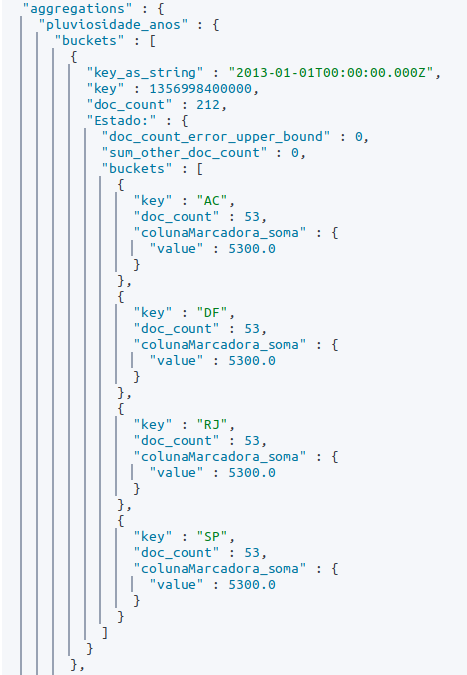

```

<!-- pensar se deve-se acrescentar algo ao discover-->

Assim, portanto, pode-se deduzir que todos os dados foram transferidos corretamente do R para o elasticsearch.

## Teste acerca das querys na tabela unificada 

O primeiro teste para a tecnologia timelion, seria para verificar se o formato estabelecido para a tabela única iria ser adequado para realizar as querys segundo a interpretação correta desejada. Desse modo, por meio das colunas marcadoras, foram realizadas querys nas colunas de dia, semana, mês e ano, a fim de verificar se os valores encontrados iriam extrapolar a ordem de grandeza atribuída a cada um desses níveis de detalhamento. Sendo eles: Para dia 10^0, para semana 10^2, para mes 10^3 e para ano 10^4. Ressalta-se que os gráficos do timelion são construídos de acordo com o interval escolhido, ou seja, caso seja escolhido o intervalo de uma semana, serão agregadas todas as observações consideradas pertencentes à uma mesma semana. Assim, os códigos referentes a cada uma das visualizações testadas e os resultados são apresentados abaixo:

Para testar a data diária, os valores devem se encontrar na grandeza de "10^0", isso indicaria que ao realizar uma query em dataDiaria, o timelion apenas iria considerar as observações com datas diárias preenchidas, não havendo nenhuma poluição, e sendo portanto retornado o resultado esperado. Segue o código de teste no timelion:

    .es(q=UF:RJ, index=massapluviosidade*, timefield=dataDiaria, metric=sum:colunaMarcadora)

O gráfico se comportou como o esperado com o interval do timelion setado para dias: (período de 01 de janeiro de 2013 a 30 de janeiro de 2013, este poderia ser extendido até 2020 com o comportamento esperado)

```{r, echo = FALSE, out.width="50%"}

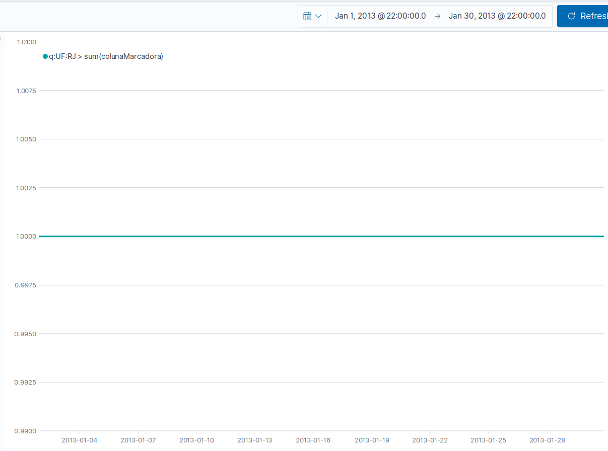

```


Para o detalhamento semanal, a grandeza esperada seria de 10^2, a hipótese é análoga:

    .es(q=UF:RJ, index=massapluviosidade*, timefield=dataSemanal, metric=sum:colunaMarcadora)

O gráfico se comportou como o esperado com o interval do timelion setado para semanas: (período de 01 de janeiro de 2013 a 30 de janeiro de 2013, este poderia ser extendido até 2020 com o comportamento esperado)

```{r, echo = FALSE, out.width="50%"}

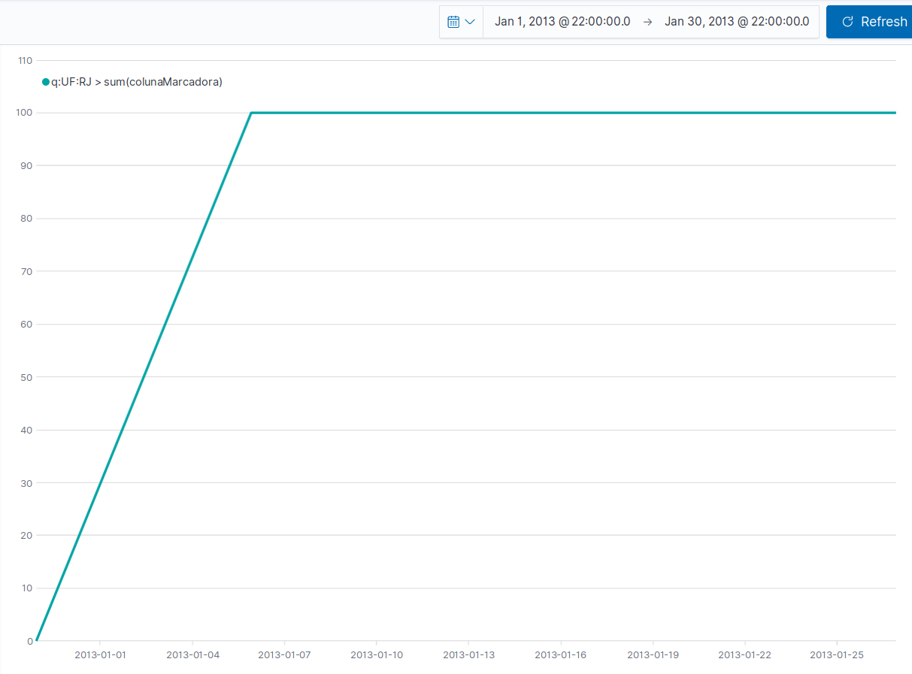

```


    
Para o detalhamento mensal, a grandeza esperada seria de 10^3, a hipótese é análoga:

    .es(q=UF:RJ, index=massapluviosidade*, timefield=dataMensal, metric=sum:colunaMarcadora)
    
O gráfico se comportou como o esperado com o interval do timelion setado para meses: (período de 01 de janeiro de 2013 a 01 de janeiro de 2020)

```{r, echo = FALSE, out.width="50%"}

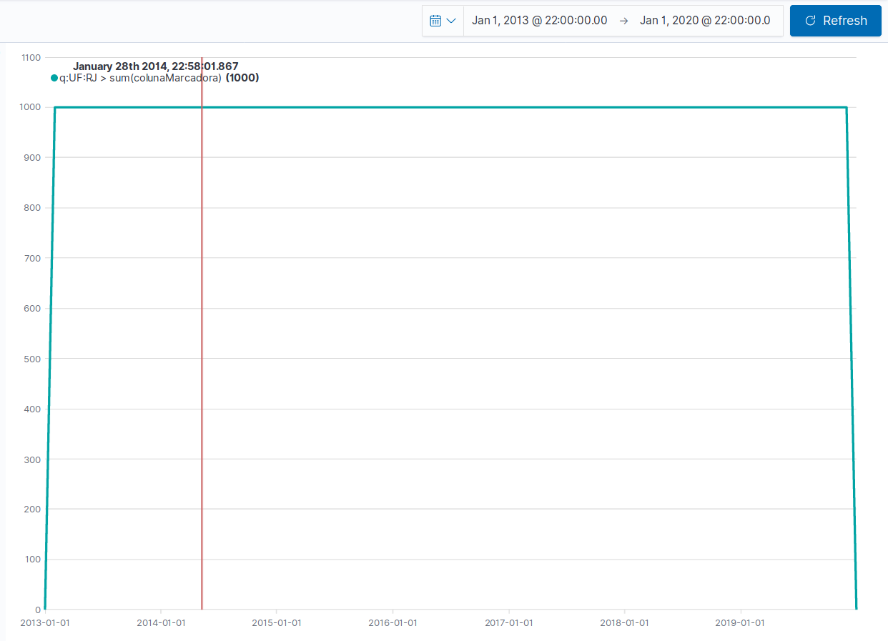

```


Para o detalhamento anual, a grandeza esperada seria de 10^4, a hipótese é análoga:

    .es(q=UF:RJ, index=massapluviosidade*, timefield=dataAnual, metric=sum:colunaMarcadora)
    
O gráfico se comportou como o esperado com o intervalo do timelion setado para anos: (período de 01 de janeiro de 2013 a 01 de janeiro de 2020)

```{r, echo = FALSE, out.width="50%"}

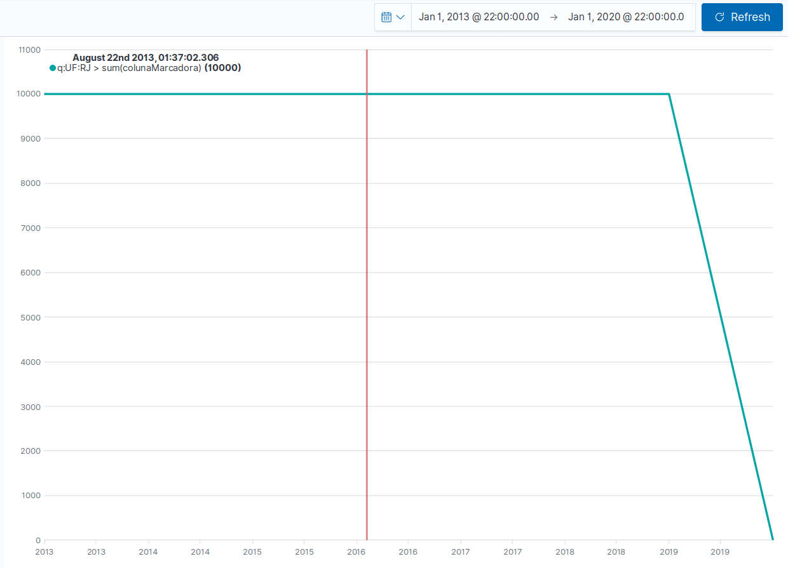

```

Desse modo, foi possível verificar que o formato de tabela única adotado é adequado, sendo que todas as querys retornaram resultados nas faixas de grandeza esperadas. 

## Agregações 

Em seguida, deveria-se verificar se o timelion executa as agregações corretamente. Para isso os resultados das agregações no R para dias, foram auditadas, em subpartes da tabela: Verificou-se se a soma semanal, para uma determinada UF estava correta. Os resultados obtidos permitiram concluir que as agregações no R estavam corretas e poderiam ser utilizadas como base de comparação para as agregações realizadas no timelion. Desse modo, agregando mensalmente, por exemplo, em pluviosidade, seria possível observar que os valores do timelion encontravam-se coerentes com os valores que foram calculados no próprio R. Nesta parte no entanto, foram obtidas ressalvas referentes à agregação por semana, que serão explicítadas mais abaixo, sendo que os resultados encontrados no timelion e no R estavam distintos. 

Verificando por exemplo, os valores dos dias 4 a 7 de janeiro de 2013, para o Estado do Acre, podemos verificar nos dados que foram enviados ao elasticsearch os valores 7.635031, 8.479488, 6.598683 e 5.090062 para cada um dos dias citados respectivamente. Para verificar, basta fazer uma query na tabela aleatória que foi gerada na sua máquina da seguinte maneira:

```{r, results="hide"}

for(dia in 4:7) {
  print(pluviosidadeFinal$pluviosidade[which((pluviosidadeFinal$dataDiaria == 
                                              paste("2013-01-0", dia, "T23:59:59", sep = "")) 
                                              & (pluviosidadeFinal$UF == "AC"))])

}
```

Construindo a curva da seguinte foram:

    .es(q=UF:AC, index=massapluviosidade*, timefield=dataDiaria, metric=sum:pluviosidade).label(diario)

Podemos observar que a curva se comporta de acordo com os valores esperados:

```{r, echo = FALSE, out.width="30%"}

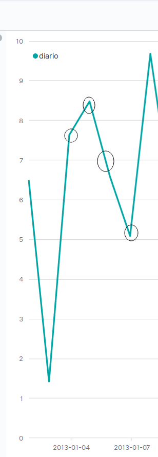

```

Agora comparando uma agregação do timelion, com os valores obtidos no R. Podemos setar o interval do timelion para mensal (1M), e realizar agregações de soma na coluna dataDiaria. Vamos realizar isto para os meses 1, 2 e 3 de 2013. Podemos verificar esses valores no R da seguinte maneira:


<!-- As datas estão para o início do mês mas deveriam estar para o final no SVDados, esse problema foi concertado na função cria_data_padrao_fator_peso  -->
```{r, results="hide"}

for(mes in 1:3) {
  print(pluviosidadeFinal$pluviosidade[which((pluviosidadeFinal$dataMensal == 
                                              paste("2013-0", mes, "-01T23:59:59", sep = "")) 
                                              & (pluviosidadeFinal$UF == "AC"))])

}

```
Os valores esperados seriam: 132.3948, 82.28507 e 120.9663 respectivamente. 

Assim apenas mudando o interval para 1M no timelion, e o intervalo de tempo para o intervalo já citado acima e utilizando os mesmos comandos, obtemos a seguinte reta, que está de acordo com o esperado:

```{r, echo = FALSE, out.width="60%"}

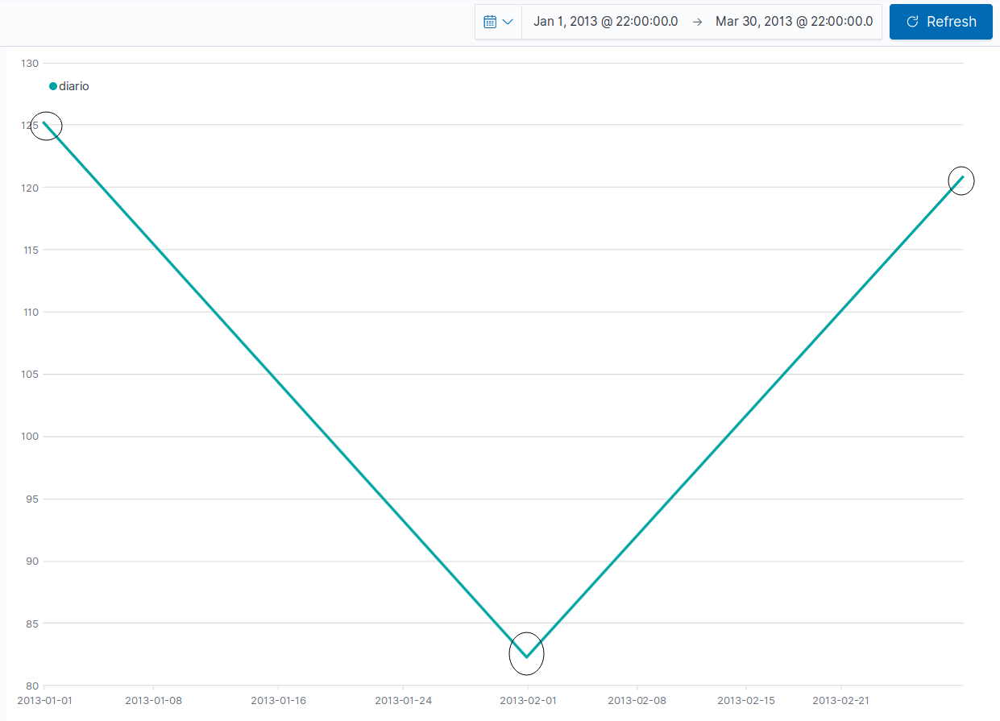

```


Nesse caso, é verificado portanto, que sim, o timelion executou as agregações de maneira correta, pois os valores encontrados foram os esperados.

## Conformidade entre curvas de dados agregados 

Em seguida, foram realizados testes relativos à conformidade das curvas do timelion, com relação aos outros níveis de agregações, era esperado que as curvas referentes aos valores diários, tivessem o mesmo formato que as curvas referentes aos valores semanal, mensal e anual quando com o interval setado corretamente. Para isso foram construídas curvas usando como timefield cada um dos níveis de detalhamento. Uma consideração importante é que as curvas somente serão iguais, se o gráfico for montado com o nível de detalhamento menor disponível. Por exemplo, se houverem dados para dias e dados para meses, entaõ a visualização deverá ser montada com as curvas sendo mostradas com a unidades das abscissas sendo meses. Caso contrário, as curvas possuirão formatos diferentes, devido à estarem formatadas em diferentes escalas.

Para realizar as comparações, serão utilizados os 4 comandos abaixo, cada um realiza uma agregação de soma na coluna pluviosidade, nos timefields específicos disponíveis, determinando uma label no gráfico e uma cor para a curva:

    .es(q=UF:SP, index=massapluviosidade*, timefield=dataDiaria, 
          metric=sum:pluviosidade).label(diario).color(yellow),
    
    .es(q=UF:SP, index=massapluviosidade*, timefield=dataSemanal, 
          metric=sum:pluviosidade).label(semanal).color(blue),
    
    .es(q=UF:SP, index=massapluviosidade*, timefield=dataMensal, 
          metric=sum:pluviosidade).label(mensal).color(red),
    
    .es(q=UF:SP, index=massapluviosidade*, timefield=dataAnual, 
          metric=sum:pluviosidade).label(anual).color(green)
    
Assim para o intervalo temporal de 1 de janeiro de 2013 a 1 de janeiro de 2020, vamos exibir as curvas para cada interval: 

Para o interval de um ano "1y", temos o seguinte gráfico:

```{r, echo = FALSE, out.width="60%"}

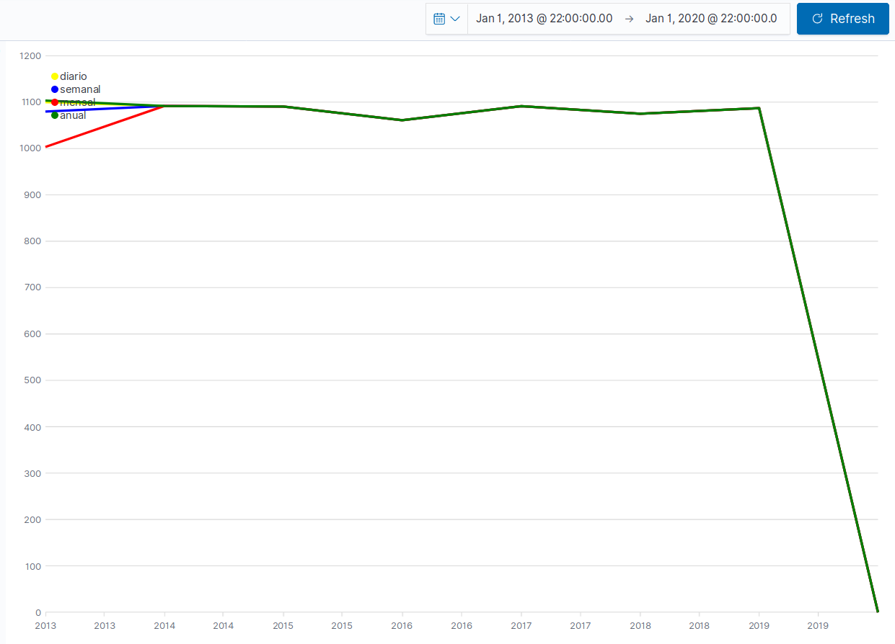

```

Como o esperado, as curvas possuem o mesmo comportamento. No entanto, nos primeiros intervalos de tempos as curvas possuem comportamentos distintos, acredita-se que isto seria devido às diferentes datas iniciais de cada curva, devido ao nível de agregação. 

Para o interval de um mês "1m", não faz sentido manter a curva para anos, por esse motivo ela foi excluída. Deste modo, segue o gráfico:

```{r, echo = FALSE, out.width="60%"}

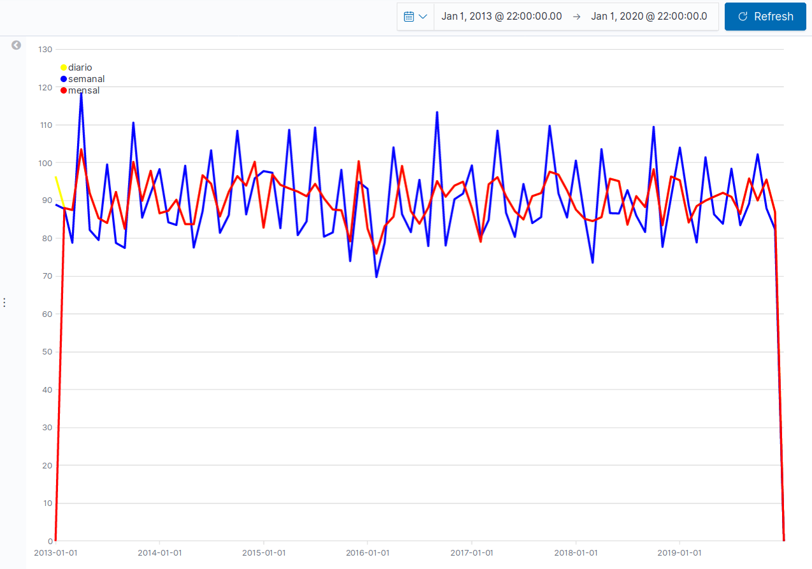

```

Observa-se que a reta de semanas, neste caso, possui um comportamento completamente distinto das demais. Enquanto que as retas diária e mensal possuem o mesmo comportamento, como o esperado. A ressalva para semanas será abordada mais abaixo. Nesse caso, no interval de semanas, também possuímos desconformidade entre as retas diária e semanal. Como podemos ver no gráfico abaixo:

```{r, echo = FALSE, out.width="60%"}

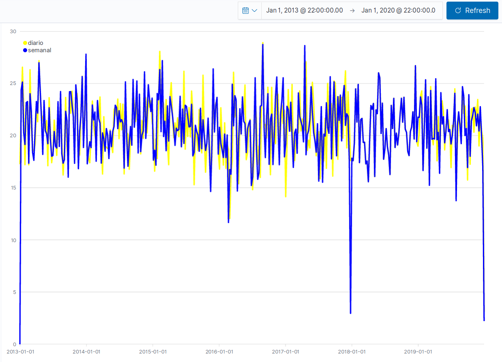

```


Assim, podemos concluir que os shapes são formados corretamente. No entanto, para os dados semanais, existem detalhes que serão tratados mais abaixo, o que provocou a não conformidade para as curvas referentes aos dados semanais em alguns níveis de escala. 

## Cálculo de indicadores e geração de gráficos 

Para testar a capacidade do timelion realizar cálculos e demosntrar indicadores, foram geradas visualizações para verificar o tipo climático de uma região, essa verificação é realizada por meio de um indicador que é a subtração da pluviosidade pela evaporação da região em um determinado período de tempo, quanto mais negativo for o resultado, mais árida é a região, e vise-versa. Este é apenas um exemplo de indicador, devido ao contexto dos dados. No entanto, seria possível realizar diversos cálculos por meio do timelion que seriam de: Divisão, subtração, soma. Além de opções condicionais, que acabarão por ser exibidas abaixo, pois precisam ser utilizadas no timelion devido à uma limitação do mesmo em não apresentar a opção de retas horizontais em um determinado valor das ordenadas. 

Para construir o indicador, o comando abaixo foi utilizado: 

    .es(q=UF:RJ, index=massapluviosidade*, 
                timefield=dataDiaria, 
                metric=sum:pluviosidade).subtract(
                  .es(q=UF:RJ, index=massapluviosidade*, 
                              timefield=dataDiaria, 
                              metric=sum:evaporacao)
                ).bars(stack=true).color(blue
    ).label("Pluviosidade menos Evaporacao na regiao selecionada")

As condicionais foram utilizadas no comando abaixo para gerar uma reta hozizontal em zero de cor vermelha, para facilitar a visualização:

    .es(*, index=massapluviosidade*, timefield=dataDiaria, metric=count).if(eq, 
        .es(*, index=massapluviosidade*, timefield=dataDiaria, metric=count), 0, 0
        ).color(red).label("Faixa Neutra")

Assim obtemos o gráfico abaixo:

```{r, echo = FALSE, out.width="60%"}

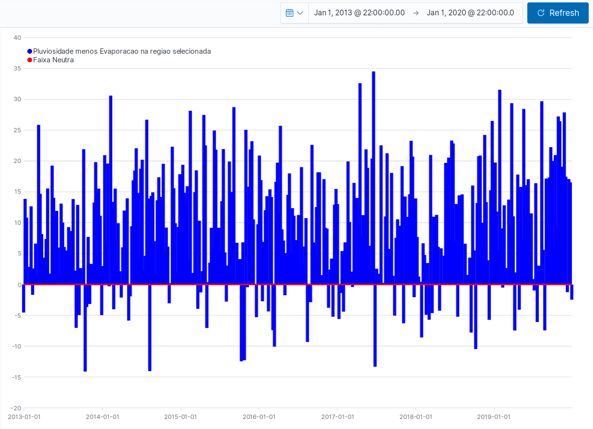

```

Poderíamos por exemplo concluir deste gráfico que o Rio de Janeiro é uma região úmida, devido ao fato de que a sua evaporação é inferior à sua pluviosidade em grande parte do tempo. Podemos observar um exemplo do mesmo gráfico para a região de São Paulo:


```{r, echo = FALSE, out.width="60%"}

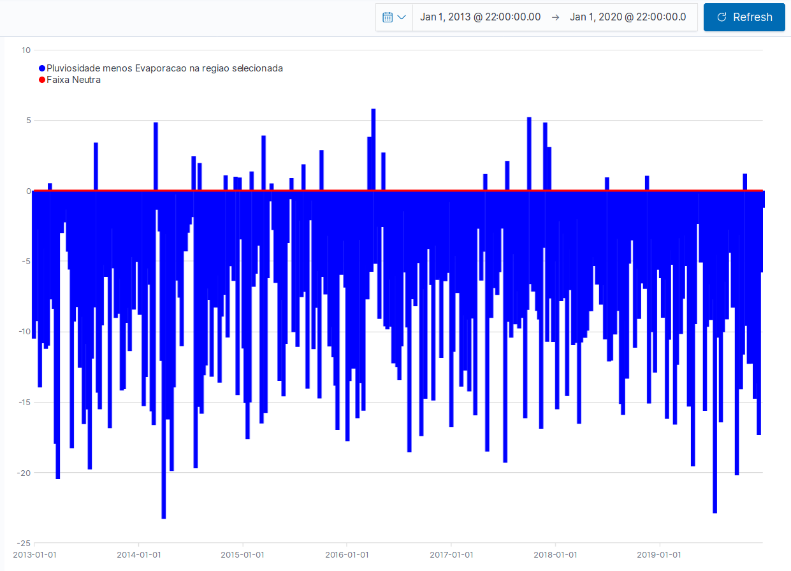

```

O que indicaria que São Paulo é uma região árida. 

Pode-se verificar no R, esses indicadores por meio dos seguintes comandos:

```{r, results="hide"}

indicador <- pluviosidadeFinal$pluviosidade - pluviosidadeFinal$evaporacao

#mostra os valores para RJ
indicador[which(!is.na(pluviosidadeFinal$dataDiaria) 
                & pluviosidadeFinal$UF == "RJ")]

#mostra os valores para SP
indicador[which(!is.na(pluviosidadeFinal$dataDiaria) 
                & pluviosidadeFinal$UF == "SP")]

#para saber o tamanho do vetor de RJ
length(indicador[which(!is.na(pluviosidadeFinal$dataDiaria) 
                       & pluviosidadeFinal$UF == "RJ")])
#indica quantos valores são maiores que zero par ao vetor de RJ
sum(indicador[which(!is.na(pluviosidadeFinal$dataDiaria) 
                    & pluviosidadeFinal$UF == "RJ")] > 0)

```

Pode-se também como opção, gerar o mesmo gráfico no R, mas a análise quantitativa dos dados já é suficiente para demonstrar a corretude do timelion. Sendo portanto, que por meio dessa avaliação somos capazes de dizes que o timelion é capaz de exibir indicadores de diversos tipos.

## Construção de dashboards utilzando visualizações do timelion

A construção de dashboards utilizando visualizações do timelion funcionam muito bem. No entanto alguns cuidados devem ser tomados na concepção das visualizações no timelion referentes as querys que serão realizadas. Também é importante possuir uma certa perspicácipa técnicas ao utilizar a dashboard, pois os filtros permitem a aferição de gráficos que podem ser incoerentes ou sem nenhum valor informativo. Desse modo, por exemplo, ao exibir o indicador criado mais acima em uma dashboard, deve-se excluir a query dos comandos do timelion, fazendo com que o gráfico seja gerado com todos os dados disponíveis. Dessa forma, a visualização irá esperar receber um dado já filtrado, pelos filtros da dashboard. Desse modo os comandos para gerar o gráfico do indicador climático ficam assim:

    .es(*, index=massapluviosidade*, 
                timefield=dataDiaria, 
                metric=sum:pluviosidade).subtract(
                  .es(*, index=massapluviosidade*, 
                              timefield=dataDiaria, 
                              metric=sum:evaporacao)
                ).bars(stack=true).color(blue
    ).label("Pluviosidade menos Evaporacao na regiao selecionada")

Ou seja, não há mais "q=UF:RJ", ao invés disso temos "*".

Assim, criando filtros para UF e de range para pluviosidade podemos obter o mesmo gráfico de RJ na dashboard abaixo, como também, o mesmo gráfico para os outros Estados:

```{r, echo = FALSE, out.width="80%"}

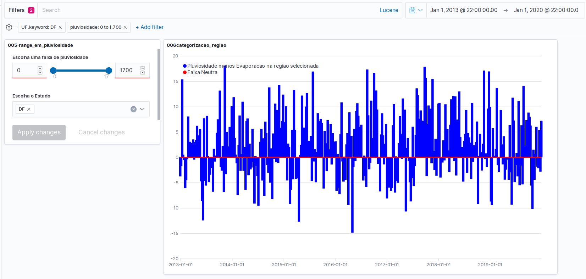

```

Perceba que se nenhum filtro for excluído teremos um gráfico sem muito valor, misturando a pluviosidade e evaporação de todas as regiãos. Da mesma forma que, se escolhermos mais de uma região, incorreremos no mesmo problema. Ainda neste contexto, o range em pluviosidade não possui nenhum valor informativo, e não deveria ser incluído na dashboard, pois apresentaria um indicador enviesado (por excluir dados de pluviosidade). No entanto, o mesmo apresenta-se como funcional, e poderia ser utilizado nos casos em que é necessário. Podemos concluir portanto, que as visualizações no timelion já devem ser construídas pensando nas dashboards as quais farão parte. 

Outra consideração importante é referente aos index, as outras ferramentas de visualização do kibana geralmente não possuem a capacidade de construir gráficos com dados provenientes de mais de um index, enquanto o timelion sim. Este fator poderia ser limitante na utilização da tecnologia do kibana, restringindo por vezes o seu uso apenas ao timelion. Por este motivo, o emprego de tecnologias alternativas de visualização para complementar as faltas do kibana e do timelion, parece ser uma solução que deveria ser seguida. Podemos dar como exemplo o shiny do R, o python, e outras tecnologias de visualização de dados.

## acrescentando maior nível de detalhamento aos dados espaciais

Os testes referentes às agregações para uma só variável com diferentes níveis de detalhamento foram realizados com sucesso. No entanto, não se pode considerar que se houver mais de uma variável com mais de um nível de detalhamento os testes estarão corretos. Desse modo a variável espacial foi expandida para incluir o nível de detalhamento municipal. Assim, apresentaremos abaixo a construção de tal variável, por meio da inclusão de uma nova função ao processo, e a realização de alguns testes que comprovam que as agregações continuam sendo realizadas corretamente pela tecnologia timelion. 

Para construir novas variáveis aleatórias foi construída uma nova função que recebe os parâmetros necessários para uma distribuição normal truncada, o novo nome da variável, os anos e constrói a nova variável:

```{r, results="hide"} 


library(EnvStats)

popula_variavel_detalhe_dias <- function(fatoresDetalhe, intervaloMedia, 
                                         intervaloSd, nomeFator, 
                                         intervaloTruncado, anos, 
                                         nomeVariavel) {
  
  resultado <- NULL
  
  distribuicoesNormais <- NULL 
  
  for(fator in fatoresDetalhe) {
    
    #Define medias e desvios padroes para a 
    #pluviosidade e evaporacao de cada estado
    #Pensar em retirar o round, para gerar 
    #valores em escala muito menor
    mean <- runif(1, intervaloMedia[1], intervaloMedia[2])
    sd <- runif(1, intervaloSd[1], intervaloSd[2]) 
    
    print(fator)
    eval(parse(text = 
                 
                 "distribuicoesNormais <- rbind(distribuicoesNormais, 
                    data.frame(" %% nomeFator %% " = fator, mean = mean, sd = sd))"
               
    ))
    
    assign("distribuicoes_normais_" %% nomeFator %% "_" %% nomeVariavel, 
           distribuicoesNormais, envir = globalenv())
    
    for(i in 1:length(anos)) {
      
      #constroi vetores de pluviosidade e evaporacao seguindo 
      #a distribuicao normal com os parametro de cada estado para cada ano
      valor <- rnormTrunc(365, mean = mean, sd = sd, 
                          min = intervaloTruncado[1], max = intervaloTruncado[2])
      
      #Criado um data frame para cada ano com respectivos 
      #dados aleatorios de pluviosidade e evaporacao
      eval(parse(text = 
                   
                   "df_aux <- data.frame(data = coluna_data_" %% anos[i] %% "," %% 
                                          nomeFator %% "= rep(fator, 365)," %% 
                                          nomeVariavel %% " = valor) 
                 
                   resultado <-"  %% "rbind( resultado, df_aux" %%  ") 
                 
                   rm(df_aux)"
                 
      ))
      
      assign("resultado", resultado, envir = globalenv())
      
    }
    
  }
  
}


```


Assim, o processo de cosntrução das variáveis muda de um só for, para a chamada desta função, junto à junção por colunas, que já havia sido citada anteriormente. Este é um exemplo específico aonde a junção por colunas é necessária:

```{r, results="hide"}


#criado um data frame (df) para cada ano, 
#com dados aleatorio de pluviosidade, 
#ao mesmo tempo estes data frames sao unificados 
#em um soh denomiado "pluviosidade"
popula_variavel_detalhe_dias(fatoresDetalhe = ufs, 
                             intervaloMedia = c(1,4), 
                             intervaloSd = c(1, 4), 
                             nomeFator = "UF", 
                             intervaloTruncado = c(0,60),
                             anos = anos, 
                             nomeVariavel = "pluviosidade")

pluviosidade <- resultado

popula_variavel_detalhe_dias(fatoresDetalhe = ufs, 
                             intervaloMedia = c(1,4), 
                             intervaloSd = c(1, 4), 
                             nomeFator = "UF", 
                             intervaloTruncado = c(0,60),
                             anos = anos, 
                             nomeVariavel = "evaporacao")

pluviosidade <- pluviosidade %>%
                  inner_join(resultado)


municipios <- c("GuarulhosSP", "CampinasSP", 
                "OsascoSP", "SorocabaSP", 
                "NiteroiRJ", "PetropolisRJ")

#Para o detalhamento de municipio a media e o desvio padrao devem ser menores,
#por indicar uma unidade menor no espaco
popula_variavel_detalhe_dias(fatoresDetalhe = municipios, 
                             intervaloMedia = c(0.2,0.4), 
                             intervaloSd = c(0.3, 0.7), 
                             nomeFator = "municipio", 
                             intervaloTruncado = c(0,60),
                             anos = anos, 
                             nomeVariavel = "pluviosidade")

pluviosidadeMun <- resultado

popula_variavel_detalhe_dias(fatoresDetalhe = municipios, 
                             intervaloMedia = c(0.2,0.4), 
                             intervaloSd = c(0.3, 0.7), 
                             nomeFator = "municipio", 
                             intervaloTruncado = c(0,60),
                             anos = anos, 
                             nomeVariavel = "evaporacao")

pluviosidadeMun <- pluviosidadeMun %>%
                      inner_join(resultado)


```

``` {r, echo = FALSE, results = "hide"}


#A funcao setDT cria um data frame a partir das colunas, agregando os valores por determinada caracteristica (fator) nas colunas escolhidas. O funcionamento eh semelhante ao group_by do dplyr ou do SQL comum
#Abaixo a pluviosidade eh agregada por soma, para semana, mes e ano. 
dfSemana <- setDT(pluviosidade)[, .(pluviosidade = sum(pluviosidade), evaporacao = sum(evaporacao)), by = .(yr = year(data), fator = week(data), UF = UF)]
dfMes <- setDT(pluviosidade)[, .(pluviosidade = sum(pluviosidade), evaporacao = sum(evaporacao)), by = .(yr = year(data), fator = month(data), UF = UF)]
dfAno <- setDT(pluviosidade)[, .(pluviosidade = sum(pluviosidade), evaporacao = sum(evaporacao)), by = .(yr = year(data), UF = UF)]

#Aqui os dados de semana, mes e dia sao formatados para o formato elasticsearch definido pelo SVDados yyyy-mm-ddTHH-MM-SS, por meio da funcao do pacote CRISPDM. As colunas sao reordenadas para o padrao definido no SVDados
dfSemana$dataSemanal <- paste(dfSemana$yr, dfSemana$fator, sep = "")
dfSemana$dataSemanal <- cria_data_padrao_fator_peso(dfSemana$dataSemanal, posAno = c(1,4), posFator = c(5,6), tipoFator = "week")
dfSemana <- dfSemana[,c("dataSemanal", "UF", "pluviosidade", "evaporacao")]

dfMes$dataMensal <- paste(dfMes$yr, dfMes$fator, sep = "")
dfMes$dataMensal <- cria_data_padrao_fator_peso(dfMes$dataMensal, posAno = c(1,4), posFator = c(5,6), tipoFator = "month")
dfMes <- dfMes[,c("dataMensal", "UF", "pluviosidade", "evaporacao")]

dfAno$dataAnual <- paste(dfAno$yr, "-12-31T23:59:59", sep = "")
dfAno <- dfAno[,c("dataAnual", "UF", "pluviosidade", "evaporacao")]

pluviosidade <- pluviosidade[,c("data", "UF", "pluviosidade", "evaporacao")]
colnames(pluviosidade) <- c("dataDiaria", "UF", "pluviosidade", "evaporacao")
pluviosidade$dataDiaria <- paste(pluviosidade$dataDiaria, "T23:59:59", sep = "")


#**********************************************************************************************AGREGACOES PARA MUNICIPIO*********************************************************************************************
#********************************************************************************************************************************************************************************************************************
df_semana_mun <- setDT(pluviosidadeMun)[, .(pluviosidade = sum(pluviosidade), evaporacao = sum(evaporacao)), by = .(yr = year(data), fator = week(data), municipio = municipio)]
df_mes_mun <- setDT(pluviosidadeMun)[, .(pluviosidade = sum(pluviosidade), evaporacao = sum(evaporacao)), by = .(yr = year(data), fator = month(data), municipio = municipio)]
df_ano_mun <- setDT(pluviosidadeMun)[, .(pluviosidade = sum(pluviosidade), evaporacao = sum(evaporacao)), by = .(yr = year(data), municipio = municipio)]

#Aqui os dados de semana, mes e dia sao formatados para o formato elasticsearch definido pelo SVDados yyyy-mm-ddTHH-MM-SS, por meio da funcao do pacote CRISPDM. As colunas sao reordenadas para o padrao definido no SVDados
df_semana_mun$dataSemanal <- paste(df_semana_mun$yr, df_semana_mun$fator, sep = "")
df_semana_mun$dataSemanal <- cria_data_padrao_fator_peso(df_semana_mun$dataSemanal, posAno = c(1,4), posFator = c(5,6), tipoFator = "week")
df_semana_mun <- df_semana_mun[,c("dataSemanal", "municipio", "pluviosidade", "evaporacao")]

df_mes_mun$dataMensal <- paste(df_mes_mun$yr, df_mes_mun$fator, sep = "")
df_mes_mun$dataMensal <- cria_data_padrao_fator_peso(df_mes_mun$dataMensal, posAno = c(1,4), posFator = c(5,6), tipoFator = "month")
df_mes_mun <- df_mes_mun[,c("dataMensal", "municipio", "pluviosidade", "evaporacao")]

df_ano_mun$dataAnual <- paste(df_ano_mun$yr, "-12-31T23:59:59", sep = "")
df_ano_mun <- df_ano_mun[,c("dataAnual", "municipio", "pluviosidade", "evaporacao")]

pluviosidadeMun <- pluviosidadeMun[,c("data", "municipio", "pluviosidade", "evaporacao")]
colnames(pluviosidadeMun) <- c("dataDiaria", "municipio", "pluviosidade", "evaporacao")
pluviosidadeMun$dataDiaria <- paste(pluviosidadeMun$dataDiaria, "T23:59:59", sep = "")

```
As mesmas agregações que já foram mostradas na sessão "Caso de teste para a validação da estrutura de tabela única e do timelion como tecnologia para a exibição de indicadores" devem ser então realizadas para Município e para Estado. Como o código é análogo, ele não será apresentado neste relatório. No entanto, a formação da tabela única final será mostrada, pois possui um mapeamento diferente, agora acrescentando o novo nível de detalhamento para Municípios. 

```{r, results= "hide"}

#Aqui sao mapeados todas as coluna disponiveis, 
#o formato da tabela final definido pelo SVDados eh assim definido,
#as colunas de data estao sendo separadas, enquanto que
#as de outras observacoes, permanecem uma soh
tipos <- c(dataDiaria = "character", dataSemanal = "character", 
           dataMensal = "character", dataAnual = "character", 
           UF = "character", municipio = "character", 
           pluviosidade = "numeric", evaporacao = "numeric")

pluviosidadeFinal <- data.frame(dataDiaria = NA, dataSemanal = NA, 
                                dataMensal = NA, dataAnual = NA, 
                                UF = NA, municipio = NA,
                                pluviosidade = NA, evaporacao = NA)


#A todas as tabelas sao adicionadas as colunas que nao possuem, de modo que fiquem no formato padrao da tabela final, para que sejam posteriormente unificadas em uma tabela soh
pluviosidade <- 
  formata_tabela_basica_formato_final(ordemFinal = colnames(pluviosidadeFinal), 
                                      tabela = pluviosidade, 
                                      mapeamento_de_tipos = tipos)
dfSemana <- 
  formata_tabela_basica_formato_final(ordemFinal = colnames(pluviosidadeFinal), 
                                      tabela = dfSemana, 
                                      mapeamento_de_tipos = tipos)
dfMes <- 
  formata_tabela_basica_formato_final(ordemFinal = colnames(pluviosidadeFinal), 
                                      tabela = dfMes, 
                                      mapeamento_de_tipos = tipos)
dfAno <- 
  formata_tabela_basica_formato_final(ordemFinal = colnames(pluviosidadeFinal),
                                      tabela = dfAno, 
                                      mapeamento_de_tipos = tipos)
pluviosidadeMun <- 
  formata_tabela_basica_formato_final(ordemFinal = colnames(pluviosidadeFinal), 
                                      tabela = pluviosidadeMun, 
                                      mapeamento_de_tipos = tipos)
df_semana_mun <-
  formata_tabela_basica_formato_final(ordemFinal = colnames(pluviosidadeFinal), 
                                      tabela = df_semana_mun, 
                                      mapeamento_de_tipos = tipos)
df_mes_mun <- 
  formata_tabela_basica_formato_final(ordemFinal = colnames(pluviosidadeFinal), 
                                      tabela = df_mes_mun,
                                      mapeamento_de_tipos = tipos)
df_ano_mun <- 
  formata_tabela_basica_formato_final(ordemFinal = colnames(pluviosidadeFinal), 
                                      tabela = df_ano_mun, 
                                      mapeamento_de_tipos = tipos)

pluviosidadeFinal <- rbind(pluviosidade, dfSemana, 
                           dfMes, dfAno, pluviosidadeMun, 
                           df_semana_mun, df_mes_mun, 
                           df_ano_mun)

```

Dessa forma a tabela final fica com o seguinte formato:

```{r, echo=FALSE} 

rbind(
    
    pluviosidadeFinal[which(!is.na(pluviosidadeFinal$dataDiaria) & (pluviosidadeFinal$UF == "AC")),][1],
    pluviosidadeFinal[which(!is.na(pluviosidadeFinal$dataSemanal) & (pluviosidadeFinal$UF == "AC")),][1],
    pluviosidadeFinal[which(!is.na(pluviosidadeFinal$dataMensal) & (pluviosidadeFinal$municipio == "GuarulhosSP")),][1],
    pluviosidadeFinal[which(!is.na(pluviosidadeFinal$dataAnual) & (pluviosidadeFinal$municipio == "GuarulhosSP")),][1]
    
  )


```

Indicando 4 níveis de detalhamento para tempo e dois níveis de detalhamento para espaço. 

Assim podemos criar a coluna marcadora neste caso, com diferentes grandezas para cada combinação entre detalhamento temporal e espacial, para verificar que os dados não são misturados em uma eventual busca. Como no exemplo abaixo:

```{r, results = "hide"}

pluviosidadeFinal$colunaMarcadora <- 1
pluviosidadeFinal$colunaMarcadora[!is.na(pluviosidadeFinal$dataDiaria) 
                                  & !is.na(pluviosidadeFinal$municipio)] <- 10^0
pluviosidadeFinal$colunaMarcadora[!is.na(pluviosidadeFinal$dataSemanal) 
                                  & !is.na(pluviosidadeFinal$municipio)] <- 10^2
pluviosidadeFinal$colunaMarcadora[!is.na(pluviosidadeFinal$dataMensal) 
                                  & !is.na(pluviosidadeFinal$municipio)] <- 10^3
pluviosidadeFinal$colunaMarcadora[!is.na(pluviosidadeFinal$dataAnual) 
                                  & !is.na(pluviosidadeFinal$municipio)] <- 10^4
pluviosidadeFinal$colunaMarcadora[!is.na(pluviosidadeFinal$dataDiaria) 
                                  & !is.na(pluviosidadeFinal$UF)] <- 10^5
pluviosidadeFinal$colunaMarcadora[!is.na(pluviosidadeFinal$dataSemanal) 
                                  & !is.na(pluviosidadeFinal$UF)] <- 10^6
pluviosidadeFinal$colunaMarcadora[!is.na(pluviosidadeFinal$dataMensal) 
                                  & !is.na(pluviosidadeFinal$UF)] <- 10^7
pluviosidadeFinal$colunaMarcadora[!is.na(pluviosidadeFinal$dataAnual) 
                                  & !is.na(pluviosidadeFinal$UF)] <- 10^8

fwrite(rbind(
    
    pluviosidadeFinal[which(!is.na(pluviosidadeFinal$dataDiaria) & (pluviosidadeFinal$UF == "AC")),][1],
    pluviosidadeFinal[which(!is.na(pluviosidadeFinal$dataSemanal) & (pluviosidadeFinal$UF == "AC")),][1],
    pluviosidadeFinal[which(!is.na(pluviosidadeFinal$dataMensal) & (pluviosidadeFinal$municipio == "GuarulhosSP")),][1],
    pluviosidadeFinal[which(!is.na(pluviosidadeFinal$dataAnual) & (pluviosidadeFinal$municipio == "GuarulhosSP")),][1]
    
  )
, file = "imagens/exemploTabela.csv")


```

Assim semelhante ao que fizemos antes, e esperando a grandeza de 10^1 para o detalhamento de dia, e de municipio, podemos construir a seguinte visualização no timelion por meio do comando:

    .es(q=municipio:GuarulhosSP, index=massapluespacial*,
          timefield=dataDiaria, metric=sum:colunaMarcadora)
          
Obtendo assim como o esperado, o seguinte gráfico (o período de intervalo é menor que o utilizado anteriormente neste relatório, pois caso maior excederia a capacidade de pontos que o timelion poderia plotar): 

``` {r, echo = FALSE, out.width="60%"}

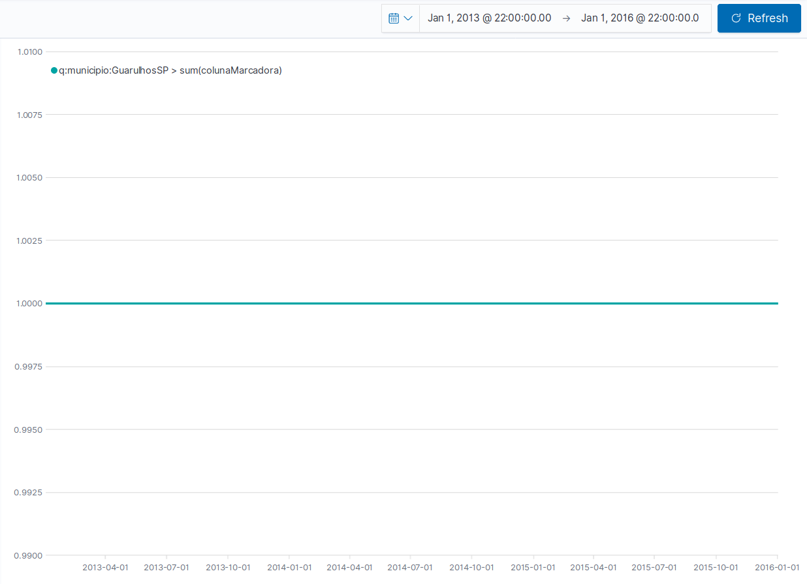

```

Obtendo, como esperado, apenas o valor de grandeza para dia e município. O que nos permite inferir que o timelion funciona corretamente para agregações neste formato de tabela única, com mais de um nível de detalhamento para mais de uma variável. Assim podemos também inferir que todos os outros resultados apresentados acima para os diferentes gráficos poderiam ser reproduzidos com a tabela única criada acima. 

No entanto, podemos fazer algumas observações para as dashboards, que deveriam obrigatoriamente, caso generalistas, ter de possuir filtros para municipio e para UF ao mesmo tempo. Onde não se poderia utilizar os dois filtros ao mesmo tempo, pois não seria exibido nenhum dado (nenhuma observação possui ao mesmo tempo município e UF). Uma segunda opção seria construir as visualizações já com as querys prontas no timelion, e utilizar apenas filtros relativos à outras características na dashboard. No entanto, poderíamos incorrer em outros problemas que ainda não foram previstos nessa análise.

<!-- A conformidade entre as agregações também foram testadas, pensar se devem ser incluídas no relatório. -->

## Limitações do timelion 

Com a grande investigação acerca das funcionalidades do timelion, segundo as necessidades do projeto arbocontrol, foi possível perceber que o timelion ainda é uma tecnologia jovem que carece de alguns recursos básicos que já existem em outras tecnologias alternativas. Abaixo vamos listar algumas das limitações encontradas e apresentar fntes que comprovam que tais problemas ainda não foram resolvidos pela comunidade desenvolvedora do timelion. 

As opções de interval devem ser incluídas manualmente, não havendo nenhum suporte nas dashboards do kibana para tal tarefa. Assim limitando a versatilidade das dashboards que podem ser construídas. No endereço a seguir temos uma melhor explicação de tal problema: https://discuss.elastic.co/t/dropdown-for-selecting-timelion-interval-in-dashboard/166544 .

Não é possível realizar a construção simples, por exemplo, de linhas verticais ou horizontais no timelion de maneira facilitada. Sendo necessários atalhos não muito legíveis em meio as visualizações, para a obtenção deste efeito. No endereço a seguir termos uma melhor explicação de tal problema: https://discuss.elastic.co/t/how-to-put-horizontal-line-in-kibana-visualization-put-static-threshold-line/82737 .

Quando as strings possue caracteres especiais em sua composição, como por exemplo "-", e "/", o timelion não é capaz de realizar as querys corretamente. Tal fato acontece com ou sem a exibição de erros, ou seja, por vezes os resultados são apresentados sem que nenhum erro seja apresentado, apesar de que, os gráficos não estão corretos (apresentam informações incongruentes com a realidade). Essa é uma caracterísitca preocupante, pois pode levar a erros graves de intepretação e por conseguinte, na tomada de decisão. 

Uma das limitações relativas ao kibana e o timelion, é a transição entre diferentes níveis de detalhamento. Por exemplo, quando com dados acerca de municípios disponíveis, para agregar tais dados em uma dashboard, de modo que se possa ver os dados de um Estado deve-se realizar o processo manual da seleção de cada um dos municípios pertencentes ao Estado. Quando deseja-se expandir tal tipo de dado, para a visualizações de mais de um Estado, a tarefa se torna praticamente impossível. Tal caracterísca limita a utilização responsiva das dashboards presentes no kibana e no timelion, obrigando a construção de dashboards focadas para a visualização de casos específicos. Estas limitações não estão presentes, por exemplo, em tecnologias de geração de dashboards como o shiny do R.

Outra observação importante refere-se ao fato de que os filtros disponibilizados para as dashboards do kibana ainda são experimentais, e portanto, ainda não são ferramentas de uso confiável.


## O problema com as agregações em períodos semanais

Como observado nos exemplos acima, as agregações por semana no timelion apresentam valores incongruentes com os restantes níveis de detalhamento. A hipótese atual é a de que o funcionamento do R lubridate relativo às datas inicias para a contagem da semana, e do timelion são distintas. Apresentando portanto valores incongruentes. Podemos afirmar que não é um problema com os dados, pois a agregação anual para o detalhamento semanal possui o mesmo comportamento das demais agregações, o que indica que existem as mesmas grandezas para os dados na faixa temporal semanal. 

Um dos problemas já identificados refere-se ao fato de que no R a contagem de semanas reinicia a cada ano, enquanto que no timelion a contagem de semanas considera apenas uma data inicial. Não se sabe ainda, no entanto, qual o efeito que este processo possui sobre as retas geradas no timelion. Acredita-se que além desse motivo, também existe algum outro motivo que seja a causa das inconformidades para as curvas semanais. 

Uma possível solução tentada, seria a utilização do offset do timelion para removimentar os valores. No entanto, este foi um equívoco, pois o que o offset faz é somente movimentar os pontos que já foram calculados pelas querys do timelion. Portanto, ainda não foi identificado o motivo pelo qual os pontos para o detalhamento semanal não estão funcionando.

## Conclusões

Neste relatório podemos observar que a estrutura de tabela única aqui proposta é suficiente e adequada para a realização de querys no timelion. Apesar dos problemas encontrados que ainda decorrem sem solução, pode-se concluir que como demonstrado, o timelion é uma tecnologia adequada para a visualização de indicadores por meio de tabelas unificadas. Devido à grande característica da estrutura ELK, o timelion também torna-se uma ferramenta muito adequada para a visualização de indicadores em tempo real, devido ao fato de que o kibana possui a capacidade de atualizar os dados que utiliza segundo os últimos dados que foram inseridos no elasticsearch. No entanto, devido às limitações apresentadas, talvez seja necessário empregar outras tecnologias junto à infraestrutura ELK, com o objetivo de satisfazer necessidades mais específicas que venham a ocorrer, ou não depender unicamente de tal estrutura. 

## Recomendações

É necessária uma maior concentração referente ao problema do interval do timelion para semanas. Devido ao funcionamento dos sistemas de informação no âmbito das arboviroses ser baseado em semana epidemiológicas, esta é uma ferramenta crucial para o projeto. Deste modo, deve ser realizado um esforço para entender bem como esse interval funciona, para que o mesmo seja adequadamente utilizado para exibir as semanas epidemiológicas. 

Devido as limitações do timelion, recomenda-se que a equipe explore tecnologias como o R shiny, o python e outras, com o objetivo de complementar o produto. Ou mesmo que se envolva diretamente com a implementação da tecnologia ELK, que está implementada em javascript, que é uma linguagem de simples acesso para pessoas técnicas, e com a qual a equipe possui uma certa experiência. Estes dois caminhos devem ser considerados no projeto. 

O aplicativo de campo deve ser imediatamente pensado para comportar as necessidades da tabela única. Deve-se decidir se o aplicativo de campo deve gerar os dados já no formato de uma tabela única, ou se deve haver um processo intermediário, ou ambos os processos concomitantemente. Para isso, deve ser levada em conta a capacidade de fornecer os dados em tempo real, e o custo de possuir um intermediário no processo, como também o custo de implementar o aplicativo de campo com a capacidade de gerar dados já no formato da tabela única. O foco, para essa tomada de decisão, deve ser no funcionamento dos mais variados joins. Pois é possível gerar a tabela única realizando joins em dados com diferentes níveis de detalhamento, no entanto este pode ser um processo com grande custo computacional. 

O logstash deve ser estudado como uma opção para os pipelines e geração das tabelas únicas, tal como outras tecnologias. 

Deve-se partir para a construção de visualizações reais, o que permitirá identificar quais são as melhores formas de utilizar as tecnologias propostas e quais serão os problemas que deverão ser resolvidos. No entanto, retifica-se que o processo da construção de dashboards é um dos mais rápidos no ciclo da exibição de dados. O processo depende da limpeza e estruturação dos dados disponíveis, o que toma mais da metade do tempo (de 60% a 90% do tempo segundo a comunidade). Desse modo, recomenda-se a adoção de processos concomitantes (tratamento, estruturação dos dados, infraestrutura e visualização dos dados) que permitam o avanço contínuo do projeto. Para isso seria interessante o acréscimo da equipe, e o treinamento das pessoas em habilidades multidisciplinares (ninguém deve focar em só um processo, mas ao menos em dois ou três), de modo que a equipe continue funcionando sem parar, até o momento da entrega do projeto. As entregas devem ser estruturadas, de modo que os dados já estruturados possam ser trabalhados nas visualizações, enquanto novos dados comecem também a ser estruturados. 

## Expectativas futuras

Espera-se que os problemas relativos ao detalhamento semanal sejam resolvidos, de modo que as semanas epidemiológicas sejam adequadamente representadas pelo timelion. Realizando o uso adequado da infraestrutura ELK para a construção dos gráficos requeridos. Os processos devem estar bem definidos, de modo que deve-se ter noção de que a transformação e estruturação dos dados demandará uma grande quantidade de tempo, sendo este o gargalo do processo, soluções devem ser alcançadas. O uso das tecnologias deve ser fechado, de modo que o projeto possa caminhar na direção em que se vislumbra o cumprimento dos requisitos. 


  


